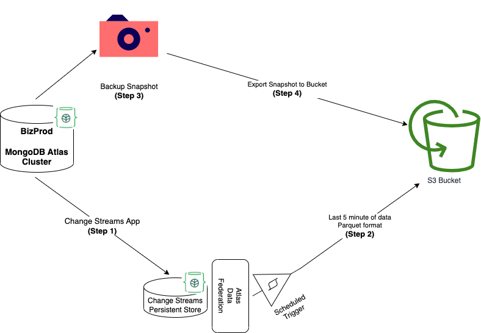

# Architecture



# Steps

## Step 1: Start capturing change streams

Create and deploy the change streams app watching all changes from the cluster and write them as documents to a separate cluster

```
pip install -r requirements.txt
```

Make a copy of `config_sample.py` and name it `config.py`. Fill the variables with appropriate values for your deployments.

```
python3 main.py
```

## Step 2: Start moving these events to the S3 bucket

Use `functions` from AtlasAppService folder and schedule it with `triggers`. You can also [export this application](https://www.mongodb.com/docs/atlas/app-services/manage-apps/configure/export-app/) to deploy quickly.

## Step 3: Capture a new backup snapshot

## Step 4: Export Snapshot to S3

This uses Atlas Admin API.

```
cd CreateExportSnapshot

pip install -r requirements.txt
```

Make a copy of `config_sample.py` and name it `config.py`. Fill the variables with appropriate values for your deployments.

```
python3 main.py
```

# Repository Structure

- main.py - Change Streams Application (Python)

---

- AtlasAppService - Scheduled Trigger Application (JavaScript)

---

- CreateExportSnapshot - Create a snapshot and export to S3 (Python)

---

# Link to Blog

https://ankurraina.medium.com/sync-mongodb-data-in-real-time-to-s3-without-aws-dms-72eaf7cf04e1
